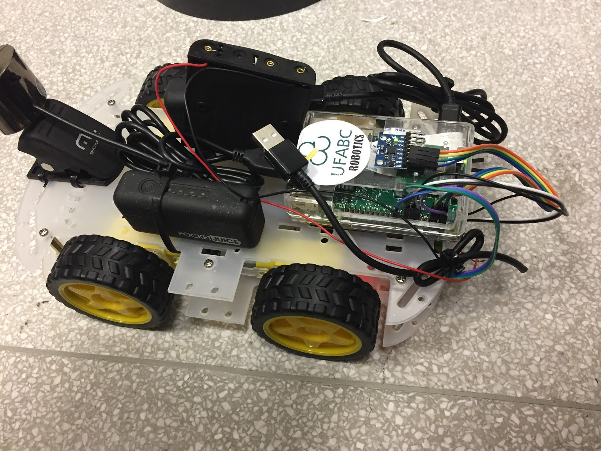
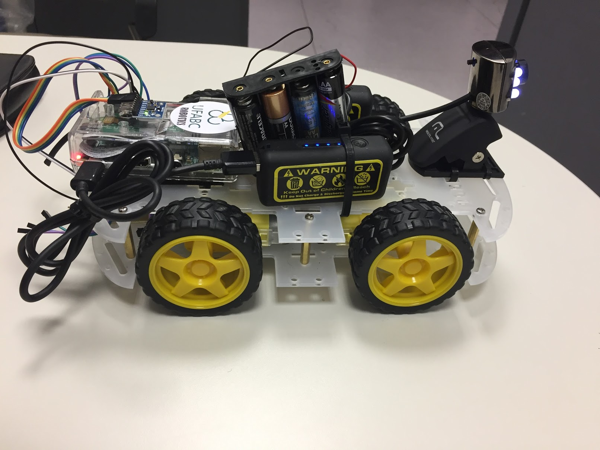

# RobotCar4WB-CAM

#The Robot car 4W

## Original idea

The original idea comes from https://github.com/phfbertoleti/RoboPi, I "stole" the idea and made some changes.

## Diagram (original project)

## Motor Drive Circuit

# Sensors and parts

* 1 - Raspberry PI 3
* 2 - Speedy Sensor Encoder
* 1 - IMU MPU-9250
* 1 - cheap camera
* 1 - GPS (soon)

## The Robot

This project is ongoing I will try to update every week but not promises! :-)
